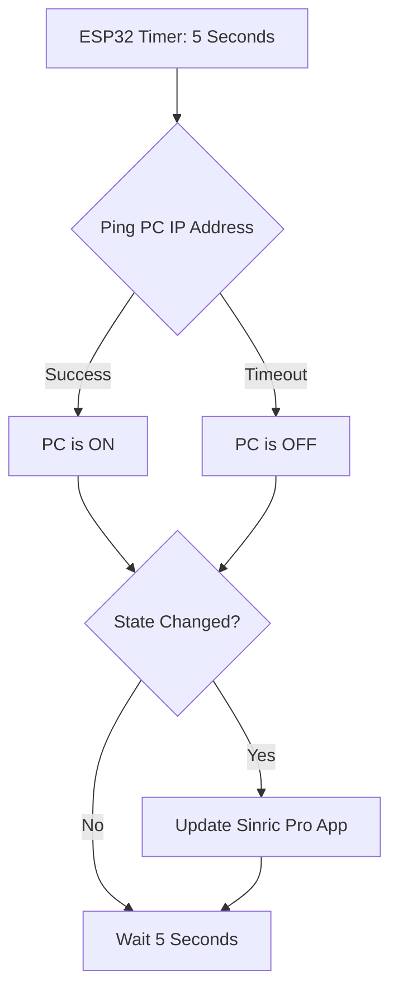
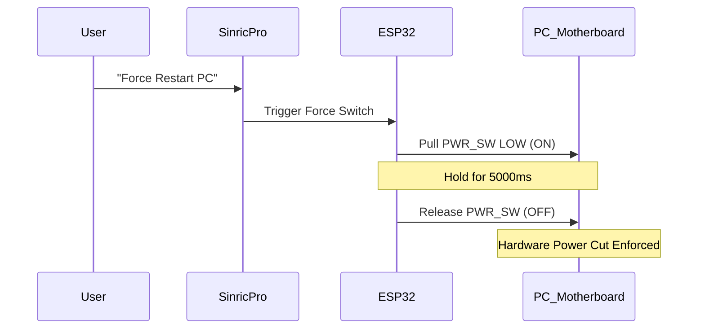

<div align="center">

# 🖥️ ESP32 Smart PC Power Controller

**Control your gaming PC with Google Assistant, Alexa, or any smart home app — using a $1 relay and an ESP32.**

[](https://platformio.org/)
[](https://sinric.pro/)
[](https://www.espressif.com/en/products/socs/esp32)
[](LICENSE)

</div>

---

## ✨ Features

| Feature | Description |
|---|---|
| 🔵 **Google Assistant / Alexa Control** | "Hey Google, turn on my PC" |
| 📡 **Live Power State Detection** | Pings your PC every 5s to know if it's really ON or OFF |
| 🛡️ **Safety Overrides** | Blocks accidental shutdown if PC is already in that state |
| ⚡ **Force Restart Kill-Switch** | Holds the power button 5s for a hardware-level reboot |
| 🔔 **Boot-Up Push Notification** | Get a phone alert the moment your PC finishes booting |
| 💸 **Zero Extra Cost** | Uses your existing ESP32 + $1 relay — no new hardware |

---

## 🧰 Hardware Required

| Component | Notes |
|---|---|
| **ESP32 Dev Board** | Any standard 38-pin ESP32 module |
| **5V Single-Channel Relay Module** | Most common ~$1 relay boards work |
| **Female-to-Female Jumper Wires** | x3 (VCC, GND, IN) |
| **PC Motherboard** | Any ATX motherboard with a front-panel PWR_SW header |

> **No transistor, no level shifter, no soldering required!** This project uses a software "True Open-Drain" trick to drive a 5V relay from the ESP32's 3.3V GPIO safely.

---

## ⚡ Wiring Diagram

```
ESP32            Relay Module
------           ------------
VIN  ─────────► VCC
GND  ─────────► GND
D21  ─────────► IN
                COM ──┐
                NO  ──┘ ← Connect these two wires to your PC motherboard's PWR_SW header
```

> ⚠️ **Do NOT use D5 (GPIO 5).** It's an ESP32 strapping pin and will cause boot failures. Use D21, D22, D13, or D27 instead.

---

## 🚀 Quick Start

### Step 1: Set Up Sinric Pro

1. Create a free account at [portal.sinric.pro](https://portal.sinric.pro).
2. Go to **Devices → Add Device**, choose **Switch**, name it **"PC Power"**.
3. Add a second **Switch** device named **"PC Force Restart"**.
4. Go to **Credentials** and copy your **App Key** and **App Secret**.

### Step 2: Add to Google Home / Alexa

1. In the Google Home or Alexa app, link the **Sinric Pro** skill.
2. Your two switches will appear as smart home devices.
3. *(Optional)* Create a Google Home Routine: Phrase "hard reset my PC" → Force Restart switch ON.

### Step 3: Add a Windows Firewall Rule

The ESP32 pings your PC to detect its power state. Windows blocks pings by default. Open **PowerShell as Administrator** and run:

```powershell
New-NetFirewallRule -DisplayName "Allow Ping (ESP32)" -Direction Inbound -Protocol ICMPv4 -IcmpType 8 -Enabled True -Profile Any -Action Allow
```

### Step 4: Configure the Firmware

1. Clone this repository:
   ```bash
   git clone https://github.com/chetangoswami/esp32-sinricpro-smart-pc-power.git
   cd esp32-sinricpro-smart-pc-power
   ```

2. Copy the example config file and fill in your details:
   ```bash
   cp src/config.example.h src/config.h
   ```
   Then edit `src/config.h`:
   ```cpp
   #define WIFI_SSID     "YourWiFi"
   #define WIFI_PASS     "YourPassword"
   #define APP_KEY       "your-sinric-app-key"
   #define APP_SECRET    "your-sinric-app-secret"
   #define SWITCH_ID               "your-power-switch-device-id"
   #define SWITCH_ID_FORCE_RESTART "your-force-restart-device-id"
   #define PC_IP_ADDRESS "192.168.1.X"   // Your PC's local IP (run ipconfig)
   #define RELAY_PIN 21
   ```

### Step 5: Flash the ESP32

1. Install [VS Code](https://code.visualstudio.com/) with the [PlatformIO extension](https://platformio.org/install/ide?install=vscode).
2. Open this project folder in VS Code.
3. Click the **Upload** button (→ arrow) in the bottom toolbar.

---

## 💡 How It Works

### The "Open-Drain" Voltage Trick
Standard 5V relay modules don't fully turn off when driven by a 3.3V ESP32 GPIO — the relay gets "stuck ON". Instead of trying to output a HIGH voltage, this firmware toggles the pin between:
- **`OUTPUT LOW`** (0V) → Relay turns ON → PC power button pressed
- **`INPUT` (floating)** → Relay turns OFF via its own 5V pull-up → No voltage fight

### Digital Ping Power Sensing
Every 5 seconds, the ESP32 sends an ICMP ping to your PC's local IP. If the ping succeeds → PC is ON. If it times out → PC is OFF. This state is pushed to Sinric Pro, so your app always shows the real, live power status.



### Force Restart Logic
When you press the **Force Restart** switch, the relay holds the PC power button for **5 seconds**. This duration bypasses Windows ACPI and triggers the motherboard's hardware-level power cut — useful when the PC is completely frozen.



---

## 📱 Usage Examples

| You Say | What Happens |
|---|---|
| *"Hey Google, turn on my PC"* | ESP32 pings PC. If OFF → relay pulses 700ms. If already ON → ignores command. |
| *"Hey Google, turn off my PC"* | ESP32 pings PC. If ON → relay pulses 700ms (graceful Windows shutdown). |
| *"Hey Google, hard reset my PC"* | Force Restart switch → relay holds for 5s → hardware kill |
| *(PC boots)* | Pings detect OFF→ON change → push notification fires on your phone |

---

## 🔧 Customization

| Setting | Location | Default |
|---|---|---|
| Relay pulse duration | `src/main.cpp` → `triggerRelay()` | `700ms` |
| Force Restart duration | `src/main.cpp` → `triggerRelayForce()` | `5000ms` |
| Ping interval | `src/main.cpp` → `PING_INTERVAL` | `5000ms` |
| Relay GPIO pin | `src/config.h` → `RELAY_PIN` | `21` |

---

## 🏗️ Project Structure

```
esp32-sinricpro-smart-pc-power/
├── src/
│   ├── main.cpp              # Main firmware logic
│   ├── config.example.h      # Configuration template (copy → config.h)
│   └── config.h              # ← Your credentials (gitignored, never committed)
├── platformio.ini            # PlatformIO board config and library dependencies
├── .gitignore
└── README.md
```

---

## 📦 Libraries Used

| Library | Purpose |
|---|---|
| [SinricPro](https://github.com/sinricpro/esp8266-esp32-sdk) | Cloud control via Alexa/Google |
| [ESP32Ping](https://github.com/marian-craciunescu/ESP32Ping) | ICMP ping for power state detection |
| [ArduinoJson](https://arduinojson.org/) | JSON parsing for Sinric Pro |
| [WebSockets](https://github.com/Links2004/arduinoWebSockets) | WebSocket transport for Sinric Pro |

---

## 🤝 Contributing

Pull requests are welcome! For major changes, please open an issue first.

---

## 📄 License

MIT © [Chetan Goswami](https://github.com/chetangoswami)
