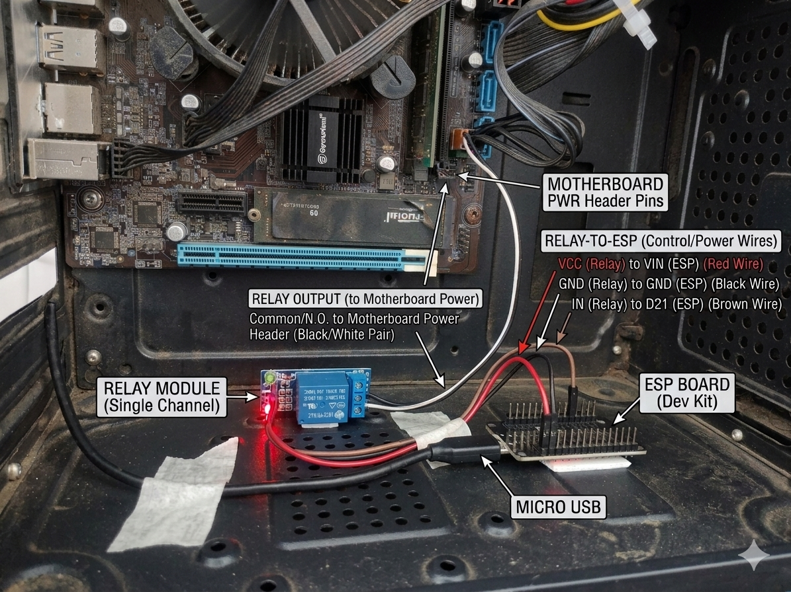
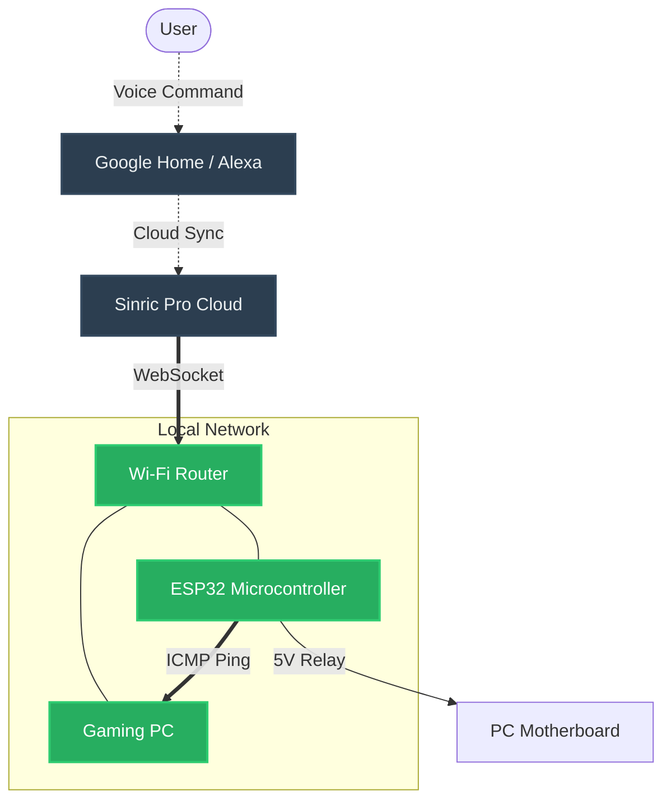
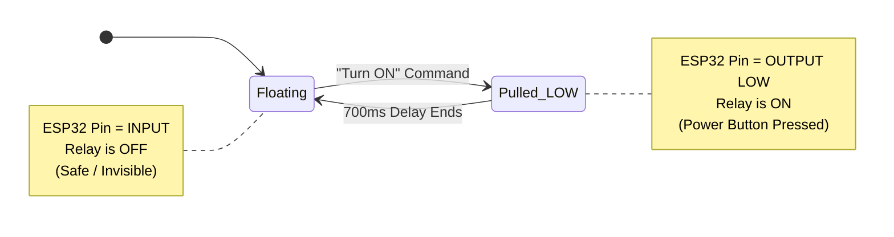
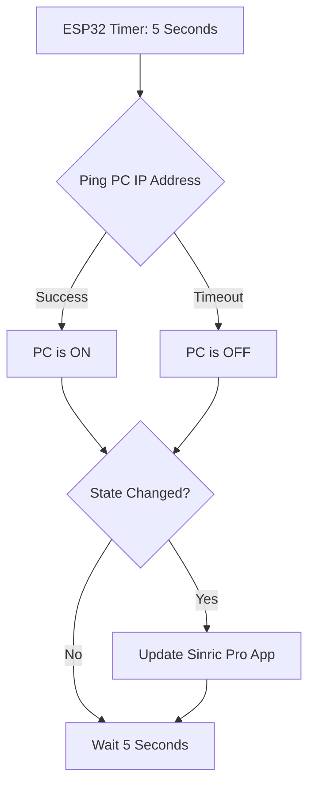
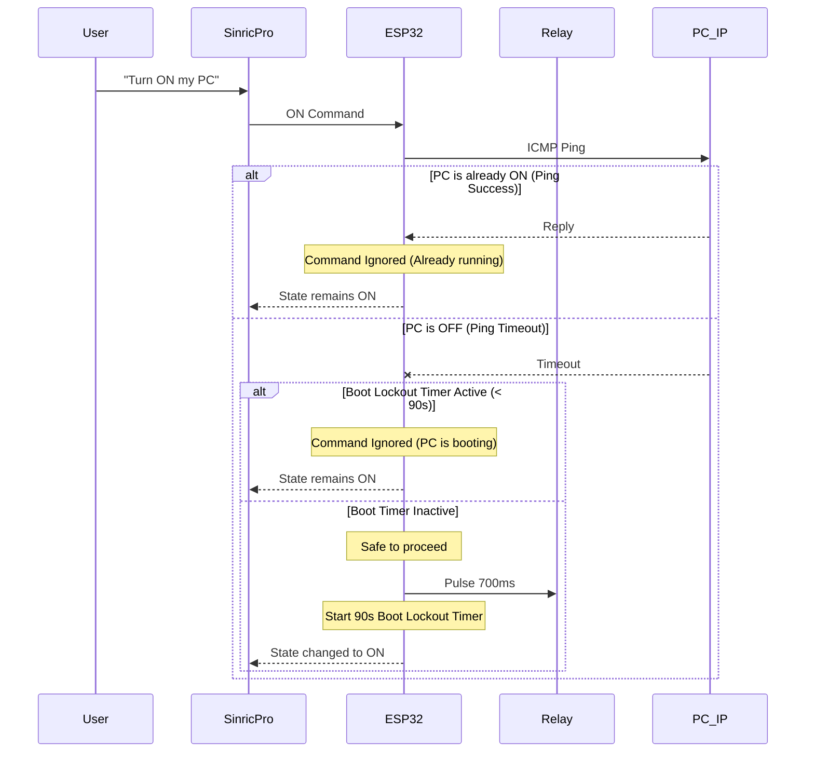

<div align="center">

# 🖥️ ESP32 Smart PC Power Controller

**Control your gaming PC with Google Assistant, Alexa, Siri, or any smart home app — using a $1 relay and an ESP32.**

[](https://platformio.org/)
[](https://sinric.pro/)
[](https://www.espressif.com/en/products/socs/esp32)
[](LICENSE)

</div>

---

## 📑 Table of Contents
- [Features](#-features)
- [Hardware Required](#-hardware-required)
- [Wiring Diagram](#-wiring-diagram)
- [Getting Started (Setup Guide)](#-getting-started)
- [How It Works](#-how-it-works)
- [Usage Examples](#-usage-examples)
- [Customization](#-customization)

---

## ✨ Features

| Feature | Description |
|---|---|
| 🔵 **Google Assistant / Alexa / Siri** | "Hey Google / Siri, turn on my PC" |
| 📡 **Live Power State Detection** | Pings your PC every 5s to know if it's really ON or OFF |
| 🛡️ **Safety Overrides** | Blocks accidental shutdown and ignores power commands while booting (90s lockout) |
| ⚡ **Force Restart Kill-Switch** | Holds the power button 8s for a hardware-level reboot |
| 🔔 **Boot-Up Push Notification** | Receive a phone alert the moment your PC finishes booting |
| 💸 **Zero Extra Cost** | Uses your existing ESP32 + $1 relay — no new hardware |

---

## 🧰 Hardware Required

| Component | Notes |
|---|---|
| **ESP32 Dev Board** | Any standard 38-pin ESP32 module |
| **5V Single-Channel Relay Module** | Most common ~$1 relay boards work |
| **Female-to-Female Jumper Wires** | x3 (VCC, GND, IN) |
| **PC Motherboard** | Any ATX motherboard with a front-panel PWR_SW header |

> **No transistor, no level shifter, no soldering required!** This project uses a software "True Open-Drain" trick to drive a 5V relay from the ESP32's 3.3V GPIO safely.

---

## ⚡ Wiring Diagram

```
ESP32            Relay Module
------           ------------
VIN  ─────────► VCC
GND  ─────────► GND
D21  ─────────► IN
                COM ──┐
                NO  ──┘ ← Connect these two wires to your PC motherboard's PWR_SW header
```

> ⚠️ **Do NOT use D5 (GPIO 5).** It's an ESP32 strapping pin and will cause boot failures. Use D21, D22, D13, or D27 instead.

---

## 🚀 Getting Started



**We've moved all hardware, wiring, Sinric Pro, and Firewall setup instructions to a dedicated guide.**

👉 **[Setup Guide & Tutorial](USER_GUIDE.md)** | 🚑 **[Troubleshooting & FAQ](USER_GUIDE.md#7-troubleshooting--faq)**

---

## 💡 How It Works

### High-Level System Architecture
Here is how the entire system communicates. The ESP32 acts as the bridge between the Cloud (Google/Alexa) and your physical hardware (the PC Case).



### The "Open-Drain" Voltage Trick
Standard 5V relay modules don't fully turn off when driven by a 3.3V ESP32 GPIO — the relay gets "stuck ON". Instead of trying to output a HIGH voltage, this firmware toggles the pin between:
- **`OUTPUT LOW`** (0V) → Relay turns ON → PC power button pressed
- **`INPUT` (floating)** → Relay turns OFF via its own 5V pull-up → No voltage fight



### Digital Ping Power Sensing
Every 5 seconds, the ESP32 sends an ICMP ping to your PC's local IP. If the ping succeeds → PC is ON. If it times out → PC is OFF. This state is pushed to Sinric Pro, so your app always shows the real, live power status.



### Force Restart Logic
When you press the **Force Restart** switch, the relay holds the PC power button for **8 seconds**. This duration bypasses Windows ACPI and triggers the motherboard's hardware-level power cut — useful when the PC is completely frozen.


### Safety Overrides
To prevent you from accidentally turning off your PC while gaming, or turning it "ON" when it is already running (which would actually shut it down), the ESP32 intercepts commands and checks the real `<PC_IP>` state first. Furthermore, a **90-second Boot Lockout** prevents rapid, consecutive "Turn ON" requests while the PC is still starting up.



---

## 📱 Usage Examples

| You Say | Platform | What Happens |
|---|---|---|
| *"Hey Google, turn on my PC"* | Google Assistant | ESP32 pings PC. If OFF → relay pulses 700ms. If already ON → ignores. |
| *"Alexa, turn on Gaming PC"* | Amazon Alexa | Same safety logic applies. |
| *"Hey Siri, turn on my PC"* | Apple Shortcuts | Triggers the Sinric Pro shortcut action. Same safety logic. |
| *"Hey Google, turn off my PC"* | Google Assistant | ESP32 pings PC. If ON → relay pulses 700ms (graceful shutdown). |
| *"Hey Google, hard reset my PC"* | Google Assistant | Force Restart switch → relay holds for 8s → hardware kill |
| *(PC boots)* | Any | Pings detect OFF→ON change → push notification fires on your phone |

---

## 🔧 Customization

| Setting | Location | Default |
|---|---|---|
| Relay pulse duration | `src/main.cpp` → `triggerRelay()` | `700ms` |
| Force Restart duration | `src/main.cpp` → `triggerRelayForce()` | `8000ms` |
| Ping interval | `src/main.cpp` → `PING_INTERVAL` | `5000ms` |
| Relay GPIO pin | `src/config.h` → `RELAY_PIN` | `21` |

---

## 🏗️ Project Structure

```
esp32-sinricpro-smart-pc-power/
├── src/
│   ├── main.cpp              # Main firmware logic
│   ├── config.example.h      # Configuration template (copy → config.h)
│   └── config.h              # ← Your credentials (gitignored, never committed)
├── platformio.ini            # PlatformIO board config and library dependencies
├── .gitignore
└── README.md
```

---

## 📦 Libraries Used

| Library | Purpose |
|---|---|
| [SinricPro](https://github.com/sinricpro/esp8266-esp32-sdk) | Cloud control via Alexa/Google |
| [ESP32Ping](https://github.com/marian-craciunescu/ESP32Ping) | ICMP ping for power state detection |
| [ArduinoJson](https://arduinojson.org/) | JSON parsing for Sinric Pro |
| [WebSockets](https://github.com/Links2004/arduinoWebSockets) | WebSocket transport for Sinric Pro |

---

## 🤝 Contributing

Pull requests are welcome! For major changes, please open an issue first.

---

## 📄 License

MIT © [Chetan Goswami](https://github.com/chetangoswami)
