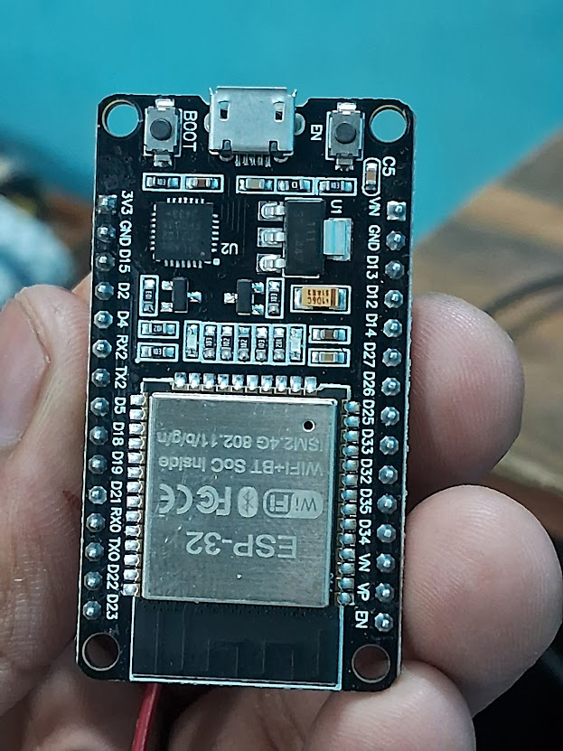
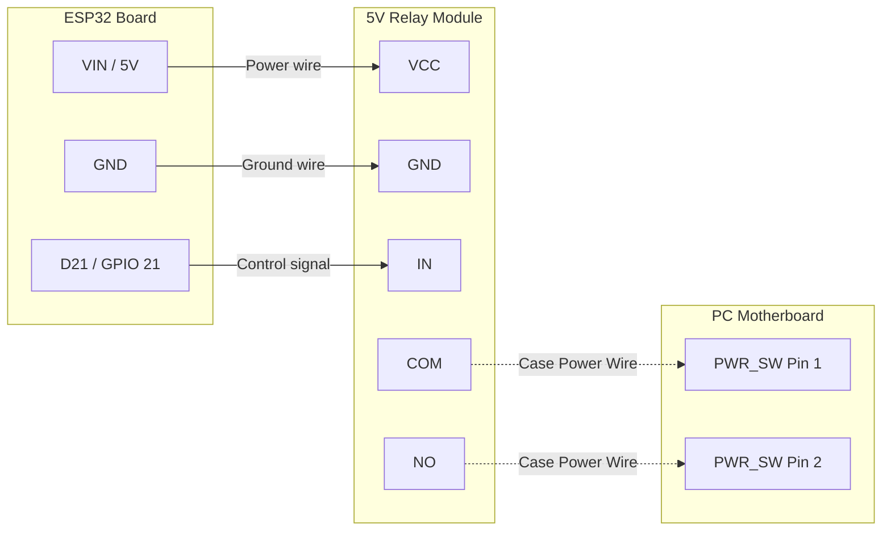

# 📖 Complete Setup Guide & Troubleshooting

Welcome to the full user guide for the **ESP32 Smart PC Power Controller**. This document provides detailed, step-by-step instructions for getting your project up and running from scratch, plus solutions to the most common problems.

> ⏱️ **Estimated setup time:** 15-20 minutes
> 🔙 **[Return to Main Project README](README.md)**

---

## 📑 Table of Contents
1. [Prerequisites](#1-prerequisites)
2. [Hardware Setup & Wiring](#2-hardware-setup--wiring)
3. [Software Setup (Sinric Pro)](#3-software-setup-sinric-pro)
4. [Flashing the Firmware](#4-flashing-the-firmware)
5. [Windows Configuration (Firewall)](#5-windows-configuration-firewall)
6. [Testing the System](#6-testing-the-system)
7. [Google Home Setup](#7-google-home-setup)
8. [Amazon Alexa Setup](#8-amazon-alexa-setup)
9. [Siri Control via Apple Shortcuts](#9-siri-control-via-apple-shortcuts)
10. [Troubleshooting & FAQ](#10-troubleshooting--faq)

---

## 1. Prerequisites

Before you begin, make sure you have the following:

### Hardware
* **ESP32 Development Board** (NodeMCU-32S, WROOM-32, etc.)
* **5V Single-Channel Relay Module** (Low-Level Trigger or High/Low adjustable)
* **Female-to-Female Jumper Wires** (at least 3)
* A Micro-USB or USB-C cable (for data) and a reliable **5V/1A+ USB wall charger**

### Software
* A free account on [portal.sinric.pro](https://portal.sinric.pro)
* **VS Code** with the **PlatformIO** extension installed
* The Google Home or Amazon Alexa app on your smartphone

---

## 2. Hardware Setup & Wiring

Wiring the relay is straightforward, but selecting the correct pins is crucial to prevent ESP32 boot failures.



| ESP32 Pin | Relay Pin | Description |
| :--- | :--- | :--- |
| **VIN** (or 5V) | **VCC** | Provides 5V power to the relay coil. Do **NOT** use `3V3`. |
| **GND** | **GND** | System Ground. |
| **D21** (GPIO 21) | **IN** | The control signal. Do **NOT** use `D5` (strapping pin). |




### Connecting to the PC
On the opposite end of the relay (the screw terminals), connect your PC's power button wires.

1. Locate the **Front Panel Header** on your PC motherboard.
2. Find the two pins labeled `PWR_SW` (Power Switch). Your PC case's power button is usually plugged in here.
3. Unplug the case wires (or splice into them) and connect them to the **`COM`** (Common) and **`NO`** (Normally Open) terminals on the relay. *Polarity does not matter here.*

### Reverting / Uninstallation
Worried about modifying your PC hardware? Don't be! This upgrade is 100% reversible. To uninstall, simply unplug the two PC Case wires from the relay's `COM` and `NO` terminals, and plug them directly back onto the two `PWR_SW` pins on your motherboard. Your PC will immediately return to factory condition.

---

## 3. Software Setup (Sinric Pro)

We need to create two "Virtual Switches" in the cloud so Google Assistant can talk to the ESP32.

1. Log into [portal.sinric.pro](https://portal.sinric.pro).
2. Navigate to **Devices** on the left menu.
3. Click **Add Device**.
   - **Name:** "PC Power"
   - **Description:** "Main PC power button"
   - **Device Type:** `Switch`
   - Click **Save**.
4. Repeat the process to create a second device:
   - **Name:** "PC Force Restart"
   - **Description:** "8-second hardware kill switch"
   - **Device Type:** `Switch`
   - Click **Save**.
5. Navigate to **Credentials** on the left menu. Keep this tab open; you will need the `App Key`, `App Secret`, and the two `Device IDs` for the code.

---

## 4. Flashing the Firmware

1. Clone or download this repository.
2. Open the folder in **VS Code**.
3. Duplicate the `src/config.example.h` file and rename the new copy to `src/config.h`.
4. Open `src/config.h` and fill in your details:
   - Your Wi-Fi SSID and Password.
   - The Sinric Pro Credentials and Device IDs from Step 3.
   - Your PC's Local IP Address (e.g., `192.168.1.50`).
5. Click the **PlatformIO Upload (→)** button in the bottom blue toolbar of VS Code.
6. Once the upload finishes, click the **PlatformIO Serial Monitor (plug icon)** to watch it boot. You should see `[WiFi] Connected!` and `[SinricPro] Connected to cloud`.

#### CLI / Terminal Alternative
If you prefer using the command line instead of the VS Code GUI, you can flash and monitor the ESP32 using the PlatformIO Core CLI:

```bash
# Build the firmware
pio run

# Build and upload to the ESP32
pio run -t upload

# Open the Serial Monitor to watch it boot
pio device monitor -b 115200
```

---

## 5. Windows Configuration (Firewall)

The ESP32 uses your Wi-Fi router to `ping` your PC every 5 seconds. If the ping succeeds, the ESP32 knows the PC is ON. If it times out, the PC is OFF.

By default, **Windows Firewall blocks incoming pings**. We must allow them:

1. Click the Windows Start Menu and type **PowerShell**.
2. Right-click it and select **Run as Administrator**.
3. Paste the following command and hit Enter:

```powershell
New-NetFirewallRule -DisplayName "Allow Ping (ESP32)" -Direction Inbound -Protocol ICMPv4 -IcmpType 8 -Enabled True -Profile Any -Action Allow
```
> ✅ **How to verify:** Open the Command Prompt or Terminal on another device connected to your network (like a laptop or another PC) and type `ping 192.168.1.X` (replace with your PC's IP). If you get replies, the firewall rule worked!

### 5a. Set a Static IP Address
Because this project relies on pinging your PC, **you must ensure your PC's IP address never changes.** If your router reboots and hands your PC a new IP, the ESP32 will think the PC is permanently offline. 
1. Log into your Wi-Fi router's admin panel.
2. Find the **DHCP Reservation** or **Static IP** section.
3. Lock your PC's MAC address to its current local IP.

---

## 6. Testing the System

Open the Sinric Pro app on your phone (or the web dashboard).

1. **Turn ON:** Make sure your PC is off. Tap the `PC Power` switch. The relay should click, and your PC should boot. Shortly after, you should receive a push notification from the app.
2. **Safety Check:** While the PC is running, tap the `PC Power` switch to `ON` again. Nothing should happen — the ESP32 ignores this to protect your game!
3. **Turn OFF:** Command Google to "Turn off the PC". The relay will click, and Windows will gracefully shut down.
4. **Force Restart:** While the PC is running, tap the `PC Force Restart` switch. The relay will click and hold for 8 seconds, instantly killing power to the PC.

---

## 7. Google Home Setup

Sinric Pro integrates natively with **Google Home**, allowing you to control your PC with your voice through a Google smart speaker, the Google Home app, or any Android phone.

> 📱 **Requires:** Google account + Google Home app (Android / iOS).

### Linking Sinric Pro to Google Home

1. Open the **Google Home** app on your phone.
2. Tap the **`+`** icon in the top-left corner, then tap **Set up device**.
3. Select **Works with Google** (also shown as "Have something already set up?").
4. Search for **`Sinric Pro`** and tap it.
5. **Sign in** with your Sinric Pro account credentials to authorize the link.
6. Your Sinric Pro devices ("PC Power" and "PC Force Restart") will be automatically imported. Tap **Done**.

### Assigning to a Room (Optional but Recommended)

To say *"Hey Google, turn on my PC"* without specifying a room, you can optionally assign the device to your preferred room in the Home app.

1. In the Google Home app, tap the **PC Power** device card.
2. Tap the ⚙️ gear icon → **Room** → choose or create a room (e.g., "Office" or "Gaming Room").

### Testing

Say: **"Hey Google, turn on PC Power"** or add it to a Google Home routine for one-word activation.

> 💡 **Pro Tip:** In the Google Home app, you can rename the device to something shorter like `"My PC"` so you can say *"Hey Google, turn on my PC"* naturally.

---

## 8. Amazon Alexa Setup

Sinric Pro has an official **Alexa Smart Home skill**, meaning your PC switch will behave like any other smart plug in Alexa's ecosystem — controllable by voice, routines, and the Alexa app.

> 📱 **Requires:** Amazon account + Alexa app (Android / iOS).

### Enabling the Sinric Pro Skill

1. Open the **Amazon Alexa** app on your phone.
2. Tap the **☰ menu** → **Skills & Games**.
3. Search for **`Sinric Pro`** and tap **Enable to Use**.
4. **Sign in** with your Sinric Pro account credentials to authorize the link.
5. Alexa will discover your devices automatically. Tap **Done**.

### Running Device Discovery Manually

If your devices weren't detected automatically:

1. In the Alexa app, tap **Devices** → **`+`** → **Add Device** → **Other**.
2. Tap **Discover Devices**. Wait ~20 seconds for Alexa to find "PC Power" and "PC Force Restart".

### Testing

Say: **"Alexa, turn on PC Power"**

> 💡 **Pro Tip:** In the Alexa app, rename "PC Power" to just `"my PC"` under Device Settings, so you can say *"Alexa, turn on my PC"* for a more natural command.

---

## 9. Siri Control via Apple Shortcuts

The Sinric Pro iOS app now natively supports **Apple Shortcuts**, which means you can control your PC using **Siri** without any extra hardware or third-party integrations.

> 📱 **Requires:** Sinric Pro iOS app (latest version from the App Store) + Apple Shortcuts app (pre-installed on all iPhones).

### Setup Steps

1. Download or update the **Sinric Pro** app from the [iOS App Store](https://apps.apple.com/app/sinric-pro/id1536510399) and **log in** to your account. Verify that your **"PC Power"** switch is visible and online.
2. Open the **Apple Shortcuts** app on your iPhone.
3. Tap the **`+`** icon in the top-right corner to create a new shortcut.
4. Tap **Add Action** and search for **`Sinric Pro`**.
5. Select the action for your **"PC Power"** device — choose **Turn On**.
6. Tap the **`⌄` (downward chevron)** at the top of the screen to rename the shortcut.
   > ⚠️ **This name is exactly what you will say to Siri.** Choose wisely!
   > - ✅ Recommended: `"Turn on my PC"` or `"Start gaming PC"`
   > - ❌ Avoid generic names like `"PC"` that may conflict with other shortcuts.
7. Tap **Done** to save the shortcut.

### Testing

Say: **"Hey Siri, turn on my PC"**

Siri will trigger the Sinric Pro shortcut, which sends the ON command to your ESP32 via the cloud — the same safety checks (ping verification + boot lockout) apply as with Google or Alexa.

> 💡 **Pro Tip:** Create a second shortcut named `"Turn off my PC"` and link it to the **Turn Off** action for the same device. You can also create a `"Hard reset my PC"` shortcut pointing to the **PC Force Restart** device.

---

## 10. Troubleshooting & FAQ

### The Relay clicks, but the PC doesn't turn on
* **Is the relay getting 5V?** If you powered the relay from the ESP32's `3V3` pin, the electromagnet is too weak to close the contacts tightly. Move the `VCC` wire to the `VIN` or `5V` pin on the ESP32.
* **Are the wires secure?** Ensure the wires in the `COM` and `NO` screw terminals are clamped securely onto the metal wire, not the plastic insulation.

### The ESP32 boot loops or fails to start when wired
* **Are you using D5?** GPIO 5 (`D5`) is a "strapping pin". If a connected component pulls this pin HIGH or LOW during boot, the ESP32 will crash. Move your relay `IN` wire to a safe pin like `D21` or `D22` and update `config.h`.

### The PC is ON, but Sinric Pro says it's OFF
* **Did you run the Firewall rule?** The ESP32 relies on ICMP pings. If your PC blocks them, the ESP32 thinks the PC is dead. Run the PowerShell command in Step 5 as Administrator.
* **Did your PC IP address change?** If you use DHCP, your router might have given your PC a new IP address. Set a Static IP for your PC in your router's settings.

### The Relay is stuck ON permanently
* **Using a 5V relay on 3.3V logic?** Standard Arduino relays expect a 5V control signal. When the ESP32 sends 3.3V, the relay thinks it is "LOW" and stays ON forever. 
* **The Fix:** This codebase automatically handles this using a "True Open-Drain" trick (switching the pin mode to `INPUT` to float the voltage). Ensure you haven't modified the `triggerRelay()` function in `main.cpp`.

---

🔙 **[Return to Main Project README](README.md)**
