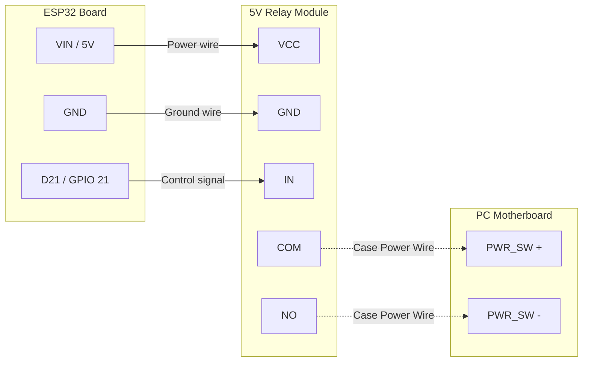

# 📖 Complete Setup Guide & Troubleshooting

Welcome to the full user guide for the **ESP32 Smart PC Power Controller**. This document provides detailed, step-by-step instructions for getting your project up and running from scratch, plus solutions to the most common problems.

---

## 📑 Table of Contents
1. [Prerequisites](#1-prerequisites)
2. [Hardware Setup & Wiring](#2-hardware-setup--wiring)
3. [Software Setup (Sinric Pro)](#3-software-setup-sinric-pro)
4. [Flashing the Firmware](#4-flashing-the-firmware)
5. [Windows Configuration (Firewall)](#5-windows-configuration-firewall)
6. [Testing the System](#6-testing-the-system)
7. [Troubleshooting & FAQ](#7-troubleshooting--faq)

---

## 1. Prerequisites

Before you begin, make sure you have the following:

### Hardware
* **ESP32 Development Board** (NodeMCU-32S, WROOM-32, etc.)
* **5V Single-Channel Relay Module** (Low-Level Trigger or High/Low adjustable)
* **Female-to-Female Jumper Wires** (at least 3)
* A micro-USB or USB-C cable (capable of data transfer)

### Software
* A free account on [portal.sinric.pro](https://portal.sinric.pro)
* **VS Code** with the **PlatformIO** extension installed
* The Google Home or Amazon Alexa app on your smartphone

---

## 2. Hardware Setup & Wiring

Wiring the relay is simple, but getting the pins right is crucial for the ESP32 to boot correctly.

| ESP32 Pin | Relay Pin | Description |
| :--- | :--- | :--- |
| **VIN** (or 5V) | **VCC** | Provides 5V power to the relay coil. Do **NOT** use `3V3`. |
| **GND** | **GND** | System Ground. |
| **D21** (GPIO 21) | **IN** | The control signal. Do **NOT** use `D5` (strapping pin). |



### Connecting to the PC
On the opposite end of the relay (the screw terminals), connect your PC's power button wires.

1. Locate the **Front Panel Header** on your PC motherboard.
2. Find the two pins labeled `PWR_SW` (Power Switch). Your PC case's power button is usually plugged in here.
3. Unplug the case wires (or splice into them) and connect them to the **`COM`** (Common) and **`NO`** (Normally Open) terminals on the relay. *Polarity does not matter here.*

---

## 3. Software Setup (Sinric Pro)

We need to create two "Virtual Switches" in the cloud so Google Assistant can talk to the ESP32.

1. Log into [portal.sinric.pro](https://portal.sinric.pro).
2. Navigate to **Devices** on the left menu.
3. Click **Add Device**.
   - **Name:** "PC Power"
   - **Description:** "Main PC power button"
   - **Device Type:** `Switch`
   - Click **Save**.
4. Repeat the process to create a second device:
   - **Name:** "PC Force Restart"
   - **Description:** "5-second hardware kill switch"
   - **Device Type:** `Switch`
   - Click **Save**.
5. Navigate to **Credentials** on the left menu. Keep this tab open; you will need the `App Key`, `App Secret`, and the two `Device IDs` for the code.

---

## 4. Flashing the Firmware

1. Clone or download this repository.
2. Open the folder in **VS Code**.
3. Duplicate the `src/config.example.h` file and rename the new copy to `src/config.h`.
4. Open `src/config.h` and fill in your details:
   - Your Wi-Fi SSID and Password.
   - The Sinric Pro Credentials and Device IDs from Step 3.
   - Your PC's Local IP Address (e.g., `192.168.1.50`).
5. Click the **PlatformIO Upload (→)** button in the bottom blue toolbar of VS Code.
6. Once the upload finishes, click the **PlatformIO Serial Monitor (plug icon)** to watch it boot. You should see `[WiFi] Connected!` and `[SinricPro] Connected to cloud`.

---

## 5. Windows Configuration (Firewall)

The ESP32 uses your Wi-Fi router to `ping` your PC every 5 seconds. If the ping succeeds, the ESP32 knows the PC is ON. If it times out, the PC is OFF.

By default, **Windows Firewall blocks incoming pings**. We must allow them:

1. Click the Windows Start Menu and type **PowerShell**.
2. Right-click it and select **Run as Administrator**.
3. Paste the following command and hit Enter:

```powershell
New-NetFirewallRule -DisplayName "Allow Ping (ESP32)" -Direction Inbound -Protocol ICMPv4 -IcmpType 8 -Enabled True -Profile Any -Action Allow
```
*Note: Make sure your PC has a Static IP address set in your router so the ESP32 doesn't lose it if the IP changes!*

---

## 6. Testing the System

Open the Sinric Pro app on your phone (or the web dashboard).

1. **Turn ON:** Make sure your PC is off. Tap the `PC Power` switch. The relay should click, and your PC should boot. Shortly after, you should receive a push notification from the app.
2. **Safety Check:** While the PC is running, tap the `PC Power` switch to `ON` again. Nothing should happen — the ESP32 ignores this to protect your game!
3. **Turn OFF:** Command Google to "Turn off the PC". The relay will click, and Windows will gracefully shut down.
4. **Force Restart:** While the PC is running, tap the `PC Force Restart` switch. The relay will click and hold for 5 seconds, instantly killing power to the PC.

---

## 7. Troubleshooting & FAQ

### The Relay clicks, but the PC doesn't turn on
* **Is the relay getting 5V?** If you powered the relay from the ESP32's `3V3` pin, the electromagnet is too weak to close the contacts tightly. Move the `VCC` wire to the `VIN` or `5V` pin on the ESP32.
* **Are the wires secure?** Ensure the wires in the `COM` and `NO` screw terminals are clamped securely onto the metal wire, not the plastic insulation.

### The ESP32 boot loops or fails to start when wired
* **Are you using D5?** GPIO 5 (`D5`) is a "strapping pin". If a connected component pulls this pin HIGH or LOW during boot, the ESP32 will crash. Move your relay `IN` wire to a safe pin like `D21` or `D22` and update `config.h`.

### The PC is ON, but Sinric Pro says it's OFF
* **Did you run the Firewall rule?** The ESP32 relies on ICMP pings. If your PC blocks them, the ESP32 thinks the PC is dead. Run the PowerShell command in Step 5 as Administrator.
* **Did your PC IP address change?** If you use DHCP, your router might have given your PC a new IP address. Set a Static IP for your PC in your router's settings.

### The Relay is stuck ON permanently
* **Using a 5V relay on 3.3V logic?** Standard Arduino relays expect a 5V control signal. When the ESP32 sends 3.3V, the relay thinks it is "LOW" and stays ON forever. 
* **The Fix:** This codebase automatically handles this using a "True Open-Drain" trick (switching the pin mode to `INPUT` to float the voltage). Ensure you haven't modified the `triggerRelay()` function in `main.cpp`.
